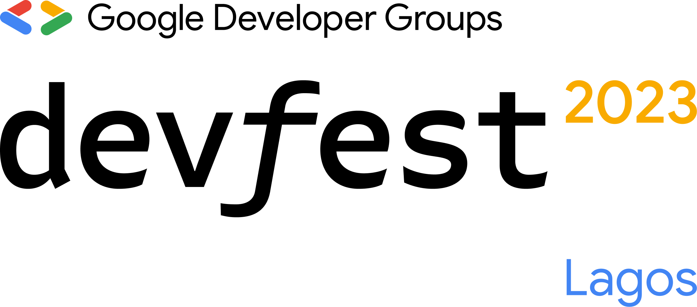

# DevFest Lagos 2023
[](https://codemagic.io/apps/64da71850bfae33ab37b51d5/dev-android/latest_build)
[](https://github.com/Mastersam07/devfest-lagos-jordan-year/actions/workflows/ci.yaml)

<p align="center">
  
</p>
<p align="center">
<a target="_blank" href='https://play.google.com/store/apps/details?id=com.gdglagos.devfestlg'></a>
<a target="_blank" href='https://apps.apple.com/us/app/devfest-lagos-23/id6471590430'></a>
</p>
<p align="center"><a href="#getting-started">:rocket: Get Started</a></p>

### Show some ❤️ and star the repo to support the project

## Overview

Some description goes here.

## 💻 Technology

- Flutter
- Firebase
- Widgetbook
- Firebase emulator
- Cloud functions

## Getting Started

1. [Fork the repository](https://github.com/Mastersam07/devfest23) and clone your fork locally
2. Install [Flutter 3.16.x](https://flutter.dev/docs/get-started/install)
3. Install [Android Studio/ IntelliJ / VSCode](https://flutter.dev/docs/development/tools/android-studio)
4. Run dev mode:
```dart
flutter run -t lib/main_staging.dart
```
5. In devmode, ensure to run the firebase emulator. For more on firebase emulator, check here.
5. Run prod mode:
```dart
flutter run -t lib/main_prod.dart
```
6. [Preparing release for android](https://flutter.dev/docs/deployment/android)
7. [Preparing release for iOS](https://flutter.dev/docs/deployment/ios)

## 📸 ScreenShots

|             iOS              |              Android              |
| :--------------------------: | :-------------------------------: |

## 🛠️ Building the project
Some description goes here

## 📄 Contributing
Some description goes here

## ❗️ Note
Some note goes here

## 🤓 Contributors

- [Samuel Abada](https://github.com/mastersam07)
- [Sebastine Odeh](https://github.com/CoderNamedHendrick)

## License

Project is published under the [MIT license](/LICENSE).
Feel free to clone and modify repo as you want, but don't forget to add reference to authors 🙂